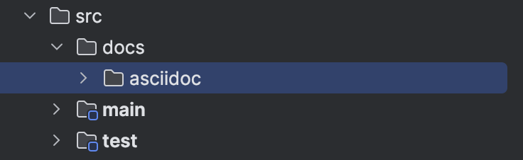
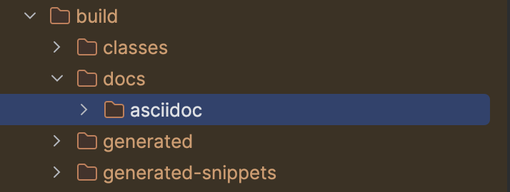

:doctype: book
:icons: font
:source-highlighter: highlightjs
:toc: left
:toclevels: 2
:sectlinks:
:sectnums:
:experimental: true

== Spring REST Docs

[IMPORTANT]
--
- Spring Rest Docs 3.0.1 버전 기준으로 작성되었다.
- Spring Boot 3.2.1 기준으로 작성되었다. (3.x 버전 문제 없음)
- Gradle 기준으로 작성되었다.
(Maven 은 일부 설정 다름)
- JUnit5 기준으로 작성되었다.
--

시작하기 전 해당 문서에 사용하는 용어를 정리한다.

====
[unordered.stack]
스니펫 (Snippet):: 문서를 생성하기 위해 테스트를 실행하면서 생성된 파일들을 의미한다.
문서 (Document):: 최종 생성 완료된 문서(HTML 파일)를 의미한다. +
생성된 스니펫을 활용하면 문서를 생성한다.
====

=== 참고 자료

- link:https://docs.spring.io/spring-restdocs/docs/current/reference/htmlsingle/#getting-started[Spring REST Docs]
- link:https://docs.asciidoctor.org/asciidoc/latest/syntax-quick-reference[AsciiDoc Quick Reference]
- link:https://jaehun2841.github.io/2019/08/04/2019-08-04-spring-rest-docs[Spring Rest Docs를 이용한 API 문서 만들기]

=== 개요

Spring REST Docs 의 목적은 RESTful 서비스에 대한 정확하고 읽기 쉬운 문서를 생성하도록 돕는 것이다.

고품질의 문서를 작성하는 것은 어렵다.
이러한 어려움을 해결하기 위한 방법은 작업에 적합한 도구를 사용하는 것이다.
이를 위해 Spring REST Docs 에서는 기본적으로 link:https://asciidoctor.org/[Asciidoctor] 를 사용한다.
Asciidoctor 는 일반 텍스트를 처리하고 필요에 맞게 스타일과 레이아웃을 갖춘 HTML 을 생성한다.

Spring REST Docs 는 테스트를 기반으로 문서를 생성한다.
테스트는 API 의 기대되는 동작을 정의하고, 테스트가 실행되면서 API 가 실제로 동작하는 방식을 문서화한다.
테스트 기반 접근 방식은 서비스 문서의 정확성을 보장하는데 도움이 된다.

=== 빌드 구성 하기

Spring REST Docs 사용하기 위해 build.gradle 파일에 설정한다.
구성의 주요 부분은 다음 목록에 설명되어 있다.

[source,gradle]
----
plugins { <1>
	id "org.asciidoctor.jvm.convert" version "3.3.2"
}

configurations {
	asciidoctorExt <2>
}

dependencies {
	asciidoctorExt 'org.springframework.restdocs:spring-restdocs-asciidoctor:{project-version}' <3>
	testImplementation 'org.springframework.restdocs:spring-restdocs-mockmvc:{project-version}' <4>
}

ext { <5>
    snippetsDir = file('build/generated-snippets')
}

test { <6>
    outputs.dir snippetsDir
    useJUnitPlatform()
}

asciidoctor { <7>
    inputs.dir snippetsDir <8>
    configurations 'asciidoctorExt' <9>

    baseDirFollowsSourceFile() <10>

    dependsOn test <11>
}
----

<1> Asciidoctor 플러그인을 적용.
<2> Asciidoctor 확장을 위한 구성을 정의.
<3> Spring REST Docs 의 Asciidoctor 확장을 의존성으로 추가. +
asciidoctorExt 에 spring-restdocs-asciidoctor 의존성을 추가하면, .adoc 파일을 사용하는 snippet 파일들을 build/generated-snippets 디렉토리에 연결한다.
<4> Spring REST Docs 의 MockMvc 테스트 지원을 의존성으로 추가.
<5> Snippet 파일들을 생성할 디렉토리를 정의.
<6> 테스트 결과로 생성된 snippet 파일들을 snippet 디렉토리에 저장.
<7> Asciidoctor 태스크를 정의.
<8> Asciidoctor 태스크의 입력 디렉토리를 snippet 디렉토리로 설정.
<9> Asciidoctor 확장을 사용하기 위해 asciidoctorExt 구성을 사용.
<10> Asciidoctor 태스크의 기본 디렉토리를 소스 디렉토리로 설정.
<11> Asciidoctor 태스크가 실행되기 전에 테스트를 실행.

=== 문서 패키징 하기

생성 완료된 문서를 jar 파일에 패키징을 하기 위해 build.gradle 파일에 다음과 같이 설정한다. +
(정적 문서를 서빙 하기 위해 jar 파일에 문서를 포함시키는 것이다.)

. jar 파일 생선 전에 문서를 생성한다.
. 문서를 생성한 후에 jar 파일을 생성한다.

[source,gradle]
----
bootJar {
    dependsOn asciidoctor <1>

    from("${asciidoctor.outputDir}") { <2>
        into 'static/docs'
    }
}
----

<1> bootJar 태스크가 실행되기 전에 asciidoctor 태스크를 실행.
<2> asciidoctor 태스크의 출력 디렉토리를 bootJar 태스크의 입력 디렉토리로 설정. +
asciidoctor 태스크의 출력 디렉토리의 파일들을 bootJar 태스크의 출력 디렉토리의 static/docs 디렉토리로 복사.

추가적으로 local 환경에서 문서를 확인하기 위해 다음과 같이 설정한다.

. 문서를 생성한 후에 resources/static 디렉토리에 문서를 복사한다.

[source,gradle]
----
tasks.register('copyDocument', Copy) { <1>
    dependsOn asciidoctor <2>

    from file("build/docs/asciidoc") <3>
    into file("src/main/resources/static/docs")
}

build {
    dependsOn copyDocument <4>
}
----

<1> copyDocument 라는 이름의 태스크를 정의.
<2> copyDocument 태스크가 실행되기 전에 asciidoctor 태스크를 실행.
<3> asciidoctor 태스크의 출력 디렉토리의 파일들을 copyDocument 태스크의 출력 디렉토리의 static/docs 디렉토리로 복사.
<4> build 태스크가 실행되기 전에 copyDocument 태스크를 실행.

=== 스니펫 생성하기

Spring REST Docs 는 테스트를 기반으로 스니펫을 생성하기에 테스트 환경을 구성해야 한다.

==== 테스트 설정하기

먼저 테스트 클래스에 `RestDocumentationExtension` 을 확장으로 추가한다.

[source,java]
----
@ExtendWith(RestDocumentationExtension.class)
public abstract class RestDocsSupport {
    // ...
}
----

RestDocumentationExtension 는 프로젝트의 빌드 도구를 기반으로 출력 디렉터리가 자동으로 구성된다. +
Gradle 을 사용하는 경우 `build/generated-snippets` 디렉토리에 snippet 파일들이 생성된다.

다음으로, MockMvc 를 설정하기 위해 `@BeforeEach` 메서드를 추가한다.

[source,java]
----
protected          MockMvc mockMvc;
protected          RestDocumentationResultHandler restDocs = write();
protected abstract Object initController(); <1>

@BeforeEach
void setUp(RestDocumentationContextProvider provider) {

    this.mockMvc = MockMvcBuilders
            .standaloneSetup(initController()) <2>
            .addFilters(new CharacterEncodingFilter(UTF_8.name(), true)) <3>
            .apply(MockMvcRestDocumentation.documentationConfiguration(provider)) <4>
            .alwaysDo(print())
            .alwaysDo(restDocs)
            .build();
}
----

<1> 테스트 클래스에서 MockMvc 를 사용하기 위해 Controller 를 생성하는 메서드를 정의한다.
<2> MockMvc 를 Controller 로 설정한다.
<3> MockMvc 에서 한글이 깨지지 않도록 필터를 추가한다.
<4> MockMvcRestDocumentation.documentationConfiguration() 메서드를 사용하여 MockMvc 를 설정한다.

추가적으로 스니펫 생성시 처리할 내용을 정의하기 위해 다음과 같이 설정한다.

. 스니펫 파일 이름을 설정한다.
. 기타 부가 설정한다.

[source,java]
----
protected          MockMvc mockMvc;
protected          RestDocumentationResultHandler restDocs = write();
protected abstract Object initController();

private RestDocumentationResultHandler write() {
    return MockMvcRestDocumentation.document(
            "{class-name}/{method-name}", <1>
            Preprocessors.preprocessRequest(Preprocessors.prettyPrint()), <2>
            Preprocessors.preprocessResponse(Preprocessors.prettyPrint()) <3>
    );
}
----

<1> 스니펫 파일 이름을 설정.
<2> 요청에 대한 스니펫을 prettyPrint 하기 위한 설정.
<3> 응답에 대한 스니펫을 prettyPrint 하기 위한 설정.

세부적인 설정은 link:https://docs.spring.io/spring-restdocs/docs/current/reference/htmlsingle/#configuration[공식 문서의 설정] 부분을 참고한다.

==== RESTful 서비스 호출하기

[source,java]
----
this.mockMvc.perform(get("/").accept(MediaType.APPLICATION_JSON)) <1>
	.andExpect(status().isOk()) <2>
	.andDo(document("index")); <3>
----

<1> GET 메서드로 "/" URL 을 호출하고, "application/json" 응답이 필요다는 것을 명시한다.
<2> 응답의 상태 코드를 명시한다.
<3> 스니펫을 생성한다.

테스트를 실행하면, build/generated-snippets/index 디렉토리에 기본으로 6개의 스니펫 생성된다.

- `<output-directory>/index/curl-request.adoc`
- `<output-directory>/index/http-request.adoc`
- `<output-directory>/index/http-response.adoc`
- `<output-directory>/index/httpie-request.adoc`
- `<output-directory>/index/request-body.adoc`
- `<output-directory>/index/response-body.adoc`

=== 스니펫 사용하기

생성된 스니펫을 사용하기 위해서는 .adoc 파일이 필요하다.
파일명은 suffix 가 `.adoc` 이면 무관하다.
최종 HTML 문서는 adoc 파일과 동일한 파일명을 가진 suffix 가 `.html` 인 파일이 생성된다.

문서 생성을 위한 .adoc 파일과 생성된 HTML 파일의 위치는 다음과 같다.

|===
|.adoc 소스 파일|.html 생성 파일

|`src/docs/asciidoc/*.adoc`|`build/docs/asciidoc/*.html`
|===

스니펫 출력 디렉터리를 참조하기 위해 빌드 구성에서 snippets 자동으로 설정되는 속성을 사용할 수 있다.

[source,adoc]
----
\include::{snippets}/index/curl-request.adoc[]
----
